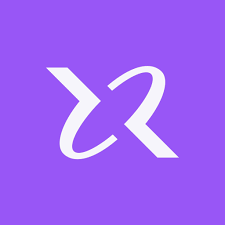
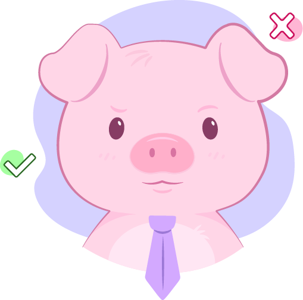

# **Primeiramente, seja muito bem vindo(a) 👋**

Aqui você encontrará todos os detalhes para participar do nosso **Hackathon**!

1. [Primeiramente, seja muito bem vindo(a) 👋](#primeiramente-seja-muito-bem-vindoa-)
2. [Qual o objetivo desse Hackathon?](#qual-o-objetivo-desse-hackathon)
3. [Premiação](#premios)
4. [Patrocinadores](#patrocinadores)
5. [Como irá funcionar?](#como-irá-funcionar)
   1. [Desafio 🎯](#desafio)
   2. [Equipes 🧑‍🤝‍🧑](#equipes)
   3. [Tempo para resolver o desafio ⏱️](#tempo-para-resolver-o-desafio)
   4. [Submissão 📥](#submissao)
   5. [Anúncio dos vencedores 📢](#anuncio-dos-vencedores)
   6. [Formatos de Entrega e Pontuação 📊](#formatos-de-entregas)
   7. [Rodadas de mentoria 👩‍🏫](#rodadas-mentoria)

# Qual o objetivo desse Hackathon?

Nosso principal objetivo é **promover uma atmosfera colaborativa e de apoio entre os membros da comunidade KipperDev**. **Queremos incentivar a troca de ideias e o trabalho em equipe para impulsionar o nosso crescimento coletivo.**

Além disso, o objetivo é estabelecer conexões significativas entre os participantes, mentores e potenciais parceiros, criando oportunidades para futuras colaborações, projetos conjuntos e desenvolvimento de relacionamentos profissionais.

Este hackathon será um espaço inclusivo onde **todos os participantes são incentivados a contribuir**, independentemente de seu nível de habilidade, formação acadêmica ou identidade.

> APROVEITE O MÁXIMO!

<h2 id="premios">Premiação 🏆</h2>

<table>
  <thead>
    <tr>
      <th>Posição</th>
      <th>Prêmio</th>
    </tr>
  </thead>
  <tbody>
    <tr>
      <td>1º Lugar 🥇</td>
      <td>R$ 500,00 p/ grupo + 1 bolsa de 1 ano da Rocketseat p/ cada participante</td>
    </tr>
    <tr>
      <td>2º Lugar 🥈</td>
      <td>R$ 300,00  p/ grupo + Vale Compras InPro (itens de setup)</td>
    </tr>
    <tr>
      <td>3º Lugar 🥉</td>
      <td>R$ 200,00  p/ grupo</td>
    </tr>
   <tr>
      <td>Pessoa Destaque ⭐</td>
      <td>Kit de Camiseta + Caneca da <a href="https://borntocode.com.br/"> BornToCode </a></td>
    </tr>
  </tbody>
</table>

<h1 id="patrocinadores">Nossos patrocinadores 💖 </h1>

Um agradecimento especial a todos patrocinadores, que permitiram esse evento acontecer.

<table>
  <tbody>
    <tr>
      <td align="center">
        <a href="https://www.rocketseat.com.br/assinatura?utm_source=influencer&utm_medium=publipost&utm_campaign=lead&utm_content=lead-one-publipost-organic-cupom_KIPPERDEV-none-none-none-none-redes_kipperdev&referral=kipperdev&coupon=KIPPERDEV">
           
          
            <b>Rocketseat</b>
          
        </a>
      </td>
      <td align="center">
        <a href="https://inpro.br.com/">
           
          
            <b>InPro</b>
          
        </a>
      </td>
    </tr>
    <tr>
      <td align="center">
        <a href="https://poku.io/pt-BR/">
           
          
            <b>Poku</b>
          
        </a>
      </td>
      <td align="center">
        <a href="https://borntocode.com.br">
           
          
            <b>BornToCode</b>
          
        </a>
      </td>
    </tr>
  </tbody>
</table>

# Como irá funcionar?

**O Hackathon funcionará em formato de equipes, onde cada equipe deve pensar em uma solução inovadora e criativa para o desafio, usando suas experiências e conhecimentos.**

<h2 id="desafio">O desafio 🎯</h2>

O meu compromisso e dessa comunidade sempre foi promover a democratização do conhecimento, em busca de uma sociedade melhor. Então, nada mais justo, para a primeira edição do nosso Hackathon, buscarmos pensar em soluções que ajudem nas diversas crises climáticas que estão ocorrendo no mundo.

<h2>"Tecnologia Contra Crises Climáticas: Soluções para Cidades Resilientes"</h2>

<h4>Descrição</h4>

As crises climáticas, como enchentes e calores extremos, são um problema recorrente que afeta muitas cidades, causando danos materiais, interrompendo serviços essenciais e colocando vidas em risco. O desafio deste Hackathon é desenvolver soluções tecnológicas que ajudem as cidades a prevenir, gerenciar e mitigar os impactos dessas crises.

<h4>Objetivo</h4>

Você e sua equipe devem criar ou idealizar uma aplicação, sistema ou serviço que utilize as tecnologias que você e seu time preferirem para enfrentar os desafios impostos pelas crises climáticas, promovendo a resiliência urbana, rápida recuperação das cidades e a segurança dos cidadãos.

<h4>Exemplos de Soluções</h4>

SOS RS: Ajuda a localizar pessoas afetadas pelas enchentes.

Earthquake: App que avisa sobre terremotos próximos e da alerta de evacuação.

Agrimídia: Mapea as perdas causadas pelas chuvas intensas no Agro.

Abrigo RS: Reúne informações sobre abrigos, como necessidades de doações e voluntários, para que as autoridades públicas possam aceder aos dados em tempo real.

Sistema de Alerta de Enchentes: Uma rede de sensores IoT que monitora os níveis de água dos rios e envia alertas em tempo real para a população e autoridades.

Plataforma de Gestão de Crises: Uma aplicação que coordena as operações de emergência, facilita a comunicação entre diferentes órgãos e fornece informações críticas durante as enchentes.

Mapeamento e Prevenção: Um sistema de análise de dados que utiliza GIS e Big Data para identificar áreas de risco, planejar medidas preventivas e otimizar a infraestrutura urbana.

App de Ajuda Comunitária: Um aplicativo que conecta voluntários, abrigos e recursos essenciais com pessoas afetadas pelas enchentes, facilitando a assistência comunitária.

<h2 id="equipes">Equipes 🧑‍🤝‍🧑</h2>

Cada equipe deve ser formada por NO MÁXIMO 4 participantes.

**Para participar, todas equipes devem submeter sua inscrição até o dia 31/07 no [formulário de cadastro de equipe](https://forms.gle/BDFhDhV8FQrFQhUJA) e confirmar sua presença através do e-mail de confirmação.**

<h2 id="tempo-para-resolver-o-desafio">Tempo para resolver o desafio ⏱️</h2>

Durante todo o final de semana, do dia 02/08 até o dia 04/08, as equipes poderão desenvolver sua solução, trabalhando com suas equipes para resolver o desafio e aproveitando das sessões de mentoria para tirar suas dúvidas.

<h2 id="submissao">Submissão 📥</h2>

No domingo, dia 04/08, será aberto o formulário para submissão das soluções, e equipes terão até às 23:59h para submeter sua solução. 

> Antes de entregar, certifique que seu time todo está alinhado, uma vez submetido, a solução não poderá ser alterada.

- Primeiro vocês deverão preencher o [formulário de submissão - EM BREVE]().
- Feito isso, vocês receberão por e-mail uma confirmação do envio (esse é o momento de alterações caso ainda necessário) e para confirmar basta seguir os passos definidos no e-mail.
- Com o envio confirmado, a equipe não poderá mais fazer alterações no projeto.
- Pronto! Agora é só esperar o resultado 🍀

<h2 id="anuncio-dos-vencedores">Anúncio dos vencedores 📢</h2>

O anúncio dos ganhadores ocorrerá no próximo final de semana, durante a live semanal do canal, dia 11/08 às 20h.

<h2 id="formato-de-entregas">Formatos de Entrega e Pontuação 📊</h2>

No Hackathon Kipper Dev, **reconhecemos que a inovação e a criatividade podem se manifestar de várias maneiras, desde uma ideia brilhante até uma aplicação totalmente funcional.** 

Para garantir que todas as equipes tenham a oportunidade de destacar seu talento e contribuição, aceitamos uma variedade de formatos de entrega, cada um atribuindo pontos específicos de acordo com a complexidade e a qualidade da entrega.

### **1. Ideia Conceitual (1 ponto cada)**

- **Descrição Textual:** Uma explicação clara e detalhada da ideia proposta, incluindo seu propósito, funcionalidades principais e potencial impacto.
- **Video Ilustrativo:** Um vídeo curto (até 3 minutos) que apresenta a ideia de forma visual e persuasiva, destacando seus principais aspectos e benefícios.

### **2. Wireframe ou Figma (2 pontos cada)**

- **Wireframe:** Uma representação visual básica da interface do usuário e do fluxo de navegação da solução proposta, ajudando a visualizar a estrutura e o layout da aplicação.
- **Figma ou Protótipo Similar:** Uma versão mais elaborada e interativa do wireframe, que permite uma experiência mais próxima da aplicação final, incluindo interações básicas e elementos visuais mais refinados.

### **3. Aplicação Desenvolvida (Pontuação variável)**

- **Aplicação Funcional:** Uma versão completa e funcional da solução proposta, desenvolvida com base nos requisitos e especificações definidos durante o hackathon. A pontuação atribuída dependerá da qualidade da execução, inovação, usabilidade e impacto da solução.

### **3. Testes Unitários ou Integração (1 ponto)**

- **Testes Unitários:** Testes unitários para verificar o comportamento de unidades individuais de código, como funções ou métodos, de forma isolada, garatindo que cada parte do código funcione conforme o esperado. Sugestão para projetos Javascript é usar a ferramenta [Poku](https://poku.io/pt-BR/).

- **Testes de Integração:** Testes de integração que verifiquem a interação do seu sistema com serviços externos ou outros módulos apartados do sistema. 

### **4. Pontuação adicional da banca**

Além dos pontos base atribuídos a cada formato de entrega, **a banca avaliadora também concederá pontos adicionais com base na criatividade, originalidade e qualidade da execução de cada projeto**. 

Isso garante que as equipes sejam recompensadas não apenas pela entrega do produto final, mas também pelo processo criativo e pela excelência na execução.

<h2 id="rodadas-mentoria">Rodadas de mentoria 👩‍🏫</h2>

Durante todo o período do **Hackathon**, estamos oferecendo sessões de mentoria interativas na [comunidade do Discord](https://discord.com/invite/D5sStBByFr) para ajudar e tirar dúvidas dos participantes. 

Nossos mentores são membros dedicados da comunidade KipperDev, selecionados por sua profunda compreensão das tecnologias e amor à tecnologia (assim como nós) 💜

> Aproveite essas sessões para tirar dúvidas sobre o desafio, pedir ajuda técnica, pitching das ideias, entre outros aspectos essenciais para o sucesso da sua equipe no hackathon!
> 

### Agenda de mentorias

### Sábado (03/08)

- 10:00h - 11:00h - Fernanda Kipper (fernandakipper)
- 11:00h - 12:00h - Leonardo Silva (leosilva0411)
- 14:00h - 16:00h - André Nunes (andrelcnunes)
- 16:00h - 17:00h - Renato Teixeira (reenatoteixeira)

### Domingo (04/08)

- 09:00h - 10:00h - Fernanda Kipper (fernandakipper)
- 14:00h - 16:00h - André Nunes (andrelcnunes)
- 16:00h - 17:00h - Renato Teixeira (reenatoteixeira)
- 19:00h - 20:00h - Leonardo Silva (leosilva0411)